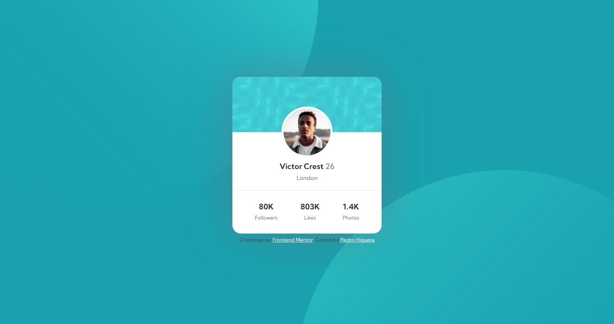

# Frontend Mentor - Profile card component solution

This is a solution to the [Profile card component challenge on Frontend Mentor](https://www.frontendmentor.io/challenges/profile-card-component-cfArpWshJ). Frontend Mentor challenges help you improve your coding skills by building realistic projects. 

## Table of contents

- [Overview](#overview)
  - [The challenge](#the-challenge)
  - [Screenshot](#screenshot)
  - [Links](#links)
- [My process](#my-process)
  - [Built with](#built-with)
  - [What I learned](#what-i-learned)
- [Author](#author)

**Note: Delete this note and update the table of contents based on what sections you keep.**

## Overview

### The challenge

- Build out the project to the designs provided

### Screenshot




### Links

- Solution URL: [Repository](https://github.com/PedroHigueraG/Profile-card-component)
- Live Site URL: [Website](https://pedrohiguerag.github.io/Profile-card-component/)

## My process

### Built with

- Semantic HTML5 markup
- CSS custom properties
- Flexbox
- Mobile-first workflow

### What I learned

I learned to add several images as background image and positionate it.

```css
main{

    background-image: url(images/bg-pattern-top.svg),url(images/bg-pattern-bottom.svg);
    background-position: -75rem -60rem,15rem 30rem;
    background-repeat: no-repeat;
}
```

## Author

- Website - [Pedro Higuera](https://pedrohiguerag.xyz/)
- Frontend Mentor - [@PedroHigueraG](https://www.frontendmentor.io/profile/PedroHigueraG)
- Twitter - [@Pedrosky664](https://twitter.com/Pedrosky664)
